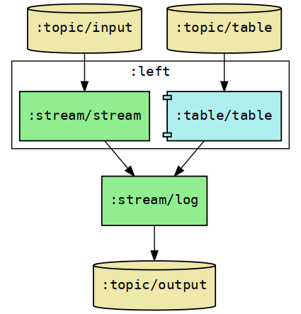

# Stream-Table Join Test

This is a small application to demonstrate the behaviour of stream-table joins, 
with respect to the `max.task.idle.ms` config property.

The topology looks like this:

Run through the repl code in `core.clj` to try it out.
